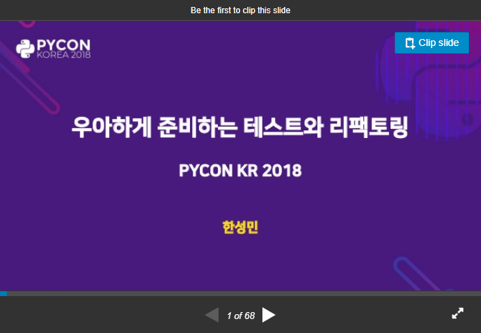

# PyCon Korea 2018


[:page_facing_up: Korean docs](i18n/KR.md)

> Gracefully Testing and Refactoring

## Presentation

[](https://www.slideshare.net/KennethCeyer/pycon-korea-2018-109833085/KennethCeyer/pycon-korea-2018-109833085)

> Unfortunately, There are no English version slides.

This repository is a kind of archive of [Pycon 2018 KR Program](https://www.pycon.kr/2018/program/24).

Announced codes and testing snippets are archived in this repository.

Check the follows instructions to start the tutorial easily.

## Getting Started

### Overview

There are a few requirements to test on your device.

Check this follows and set-up those environments.

- python 3.6 or higher
- pip

### Install

**pipenv**

This project uses pipenv to manage dependencies which this project is used.

```bash
$ pip install pipenv
```

**git clone**

In this guideline we use SSH protocol to clone our git repository, However, If you don't use this protocol you can simply change to HTTPS

```bash
$ git clone git@github.com:KennethanCeyer/pycon-kr-2018.git
$ cd pycon-kr-2018
```

**install dependencies**

You can use those simple command to download all of the dependencies.

```bash
$ pipenv install
$ pipenv shell
```

## Tutorials

- [cleancode](./src/cleancode)
    - [broken_window](./src/cleancode/broken_window)
    - [business](./src/cleancode/business)
    - [example](./src/cleancode/example)
- [tdd](./src/tdd)
- [test](./src/test)
    - [basic](./src/test/basic)
    - [complex](./src/test/complex)
    - [complex_di](./src/test/complex_di)

## Questions

If you faced some kind of problem, Ask with this email([kenneth@pigno.se](mailto://kenneth@pigno.se)).