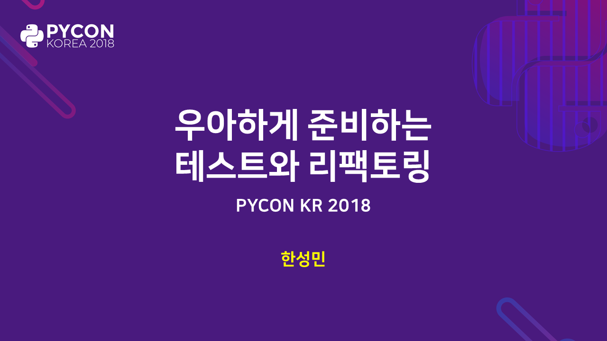
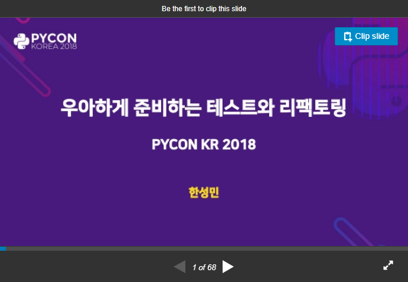

# PyCon Korea 2018



[:page_facing_up: 원문 문서](../README.md)

> 우아하게 준비하는 테스트와 리팩토링

## 발표자료

[](https://www.slideshare.net/KennethCeyer/pycon-korea-2018-109833085/KennethCeyer/pycon-korea-2018-109833085)

이 리포지토리는 [Pycon 2018 KR Program](https://www.pycon.kr/2018/program/24) 발표의 아카이브 용도입니다.

발표되었던 코드와 테스트 스니펫은 이 리포지토리에 보관되어 있습니다.

아래 지시사항을 참고해서 튜토리얼을 쉽게 진행해보세요.

## 시작하기

### 개요

여러분의 장비에서 테스트하기 위해 몇가지 요구사항이 있습니다.

아래 사항을 확인하고 여러분의 환경에 설치해주세요.

- python 3.6 혹은 이상의 버전
- pip

### 설치

**pipenv**

이 프로젝트는 사용하고 있는 의존성을 쉽게 관리하기 위해 pipenv를 사용하고 있습니다.

```bash
$ pip install pipenv
```

**깃(Git)을 통한 클론(Clone)**

여기서는 SSH 프로토콜로 클론을 하고 있지만, 여러분이 해당 프로토콜을 사용하지 않는다면 HTTPS로 간단하게 변경해서 사용하시면 됩니다.

```bash
$ git clone git@github.com:KennethanCeyer/pycon-kr-2018.git
$ cd pycon-kr-2018
```

**의존성 설치**

아래의 간단한 명령어로 모든 의존 항목을 다운로드 하실 수 있습니다.

```bash
$ pipenv install
$ pipenv shell
```

## 튜토리얼

- [cleancode](../src/cleancode)
    - [broken_window](../src/cleancode/broken_window)
    - [business](../src/cleancode/business)
    - [example](../src/cleancode/example)
- [tdd](../src/tdd)
- [test](../src/test)
    - [basic](../src/test/basic)
    - [complex](../src/test/complex)
    - [complex_di](../src/test/complex_di)

## 질문

궁금한 점이 있으시면 이 이메일([kenneth@pigno.se](mailto://kenneth@pigno.se))로 궁금한 점을 보내주시면 됩니다.